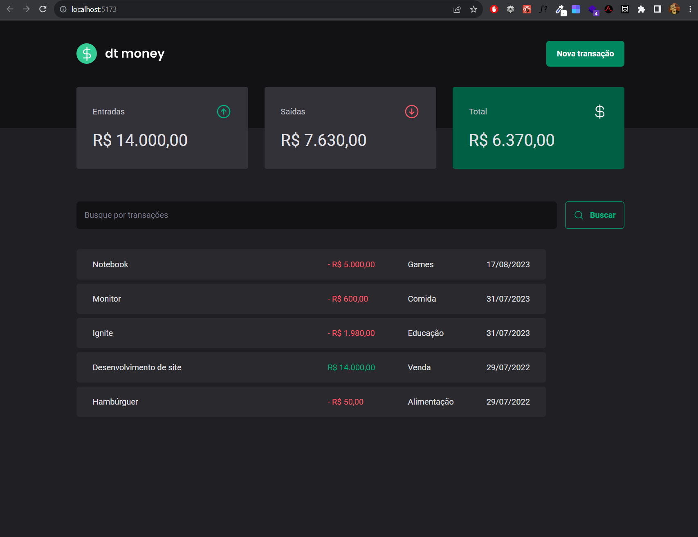
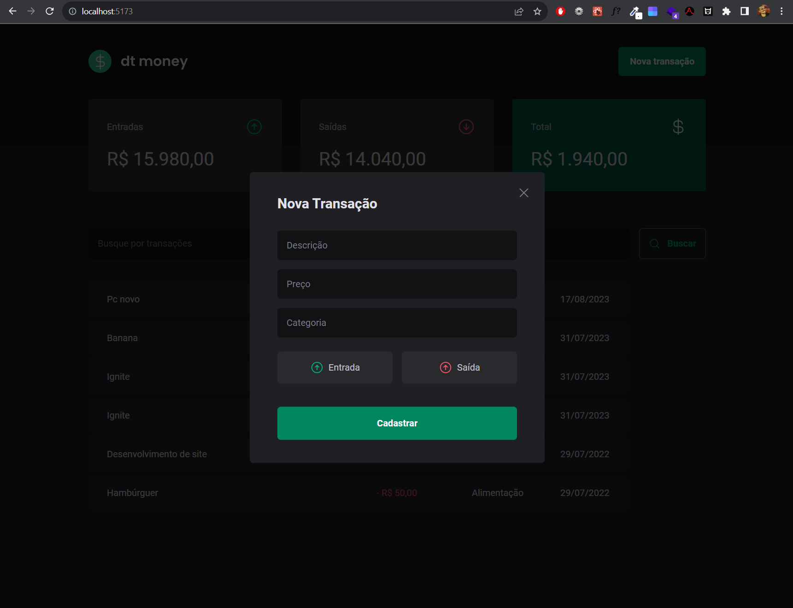

<div align="center" id="top"> 
  
</div>

<hr/>
<br>

## About

This applications is a personal finance manager.

## Screenshots

<div align="center" id="top"> 

</div>
<br/>
<br/>
<div align="center" id="top"> 
  
</div>
<br/>
<br/>

## Features

Table with personal finance data with name, amount, category and date.
Summary cards with incomes, outcomes and total.
Button that Create a new transaction using a beautiful modal.

## Technologies

The following tools were used in this project:

- [React](https://pt-br.reactjs.org/)
- [TypeScript](https://www.typescriptlang.org/)
- [Zod](https://zod.dev/)
- [Radix](https://www.radix-ui.com/)
- [Axios](https://github.com/axios/axios)
- [Styled Componensts](https://styled-components.com/)
- [Phosphor React](https://phosphoricons.com/)
- [react-hook-form](https://www.react-hook-form.com/)
- [use-context-selector](https://github.com/dai-shi/use-context-selector)
- [json-server](https://github.com/typicode/json-server)

## Starting

```bash
# Clone this project
$ git clone git@github.com:PedroHConrado/dt-money.git

# Access
$ cd dt-money

# Install dependencies
$ npm i

# Run the server
$ npm run dev:server

# Run the project
$ npm run dev

# The server will initialize in the <http://localhost:5173>
```

